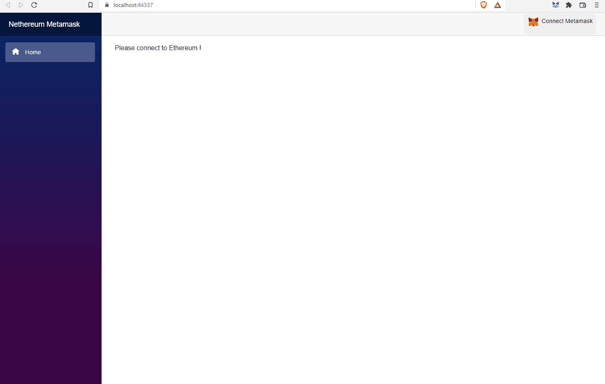

# Nethereum.Templates.Metamask.Blazor
This projects provides the quick start example/template on how to integrate Metamask + Nethereum using Blazor interop. The project allows you to work both in Wasm and Server side, so you can create a fully decentralised application using Wasm or semi-decentralised using server hosted components (Web3+Web2).

Both project types include and example on how to:
+ Configure Metamask as a UI host provider
+ Connect to Metamask
+ Interact with Ethereum using simple Web3 rpc calls (Blockhash and ChainId)
+ How to create a generic component for ERC20 token transfer including simple validation using FluentValidation 
+ How to use the EthereumAuthenticationStateProvider and the claim role "EthereumConnected" with connected account
+ How to override the default styles of the Metmask component

**Note** If you want to create your own custom Metamask component or add remove functionality check https://github.com/Nethereum/Nethereum/blob/master/src/Nethereum.Metamask.Blazor/Metamask.razor

### Demo


### Example code
#### Configuration
```csharp
builder.Services.AddSingleton<IMetamaskInterop, MetamaskBlazorInterop>();
builder.Services.AddSingleton<MetamaskInterceptor>();
builder.Services.AddSingleton<MetamaskHostProvider>();

//Add metamask as the selected ethereum host provider
builder.Services.AddSingleton(services =>
{
    var metamaskHostProvider = services.GetService<MetamaskHostProvider>();
    var selectedHostProvider = new SelectedEthereumHostProviderService();
    selectedHostProvider.SetSelectedEthereumHostProvider(metamaskHostProvider);
    return selectedHostProvider;
});

builder.Services.AddSingleton<AuthenticationStateProvider, EthereumAuthenticationStateProvider>();
builder.Services.AddValidatorsFromAssemblyContaining<Nethereum.Erc20.Blazor.Erc20Transfer>();


```
#### Page
```csharp
@page "/"
@using Nethereum.Erc20.Blazor;
@implements IDisposable;
@inject IJSRuntime jsRuntime;
@inject SelectedEthereumHostProviderService selectedHostProviderService
@inject NavigationManager _navigationManager
@inject AuthenticationStateProvider _siweAuthenticationStateProvider;
@using Nethereum.Hex.HexTypes;
@using Microsoft.AspNetCore.Components.Authorization
@using System.Security.Claims

<AuthorizeView Roles="EthereumConnected">
    <Authorized>
        <div class="card m-1">
            <div class="card-body">
                <div class="row">
                    <label class="col-sm-3 col-form-label-lg">Selected Account:</label>
                    <div class="col-sm-6">
                        @SelectedAccount
                        <small id="selectedAccountHelp" class="form-text text-muted">The selected account is bound to the host (ie Metamask) on change</small>
                    </div>
                </div>
                 <div class="row">
                    <label class="col-sm-3 col-form-label-lg">Selected Account from Claims Principal</label>
                    <div class="col-sm-6">
                        @context?.User?.FindFirst(c => c.Type.Contains(ClaimTypes.NameIdentifier))?.Value
                        <small id="selectedAccountHelp" class="form-text text-muted">The selected account is bound to the claims principal</small>
                    </div>
                </div>
            </div>
            
            <div class="card-body">
                <div class="row">
                    <label class="col-sm-3 col-form-label-lg">Selected Network ChainId:</label>
                    <div class="col-sm-6">
                        @SelectedChainId
                        <small id="selectedAccountHelp" class="form-text text-muted">The selected chain Id</small>
                    </div>
                </div>
            </div>
        </div>

        <div class="card m-1">
            <div class="card-body">
                <div class="row">
                    <label class="col-sm-3 col-form-label-lg">Block hash of block number 0:</label>
                    <div class="col-sm-6">
                        <button @onclick="@GetBlockHashAsync">Get BlockHash</button>
                        <div>@BlockHash</div>
                        <small id="selectedAccountHelp" class="form-text text-muted">With Metamask calls are redirected to its configured node (i.e http://localhost:8545)</small>
                    </div>
                </div>
            </div>
        </div>
        <Erc20Transfer></Erc20Transfer>
    </Authorized>
    <NotAuthorized>

        <div>
            Please connect to Ethereum !
        </div>

    </NotAuthorized>
</AuthorizeView>

@code {

    [CascadingParameter]
    public Task<AuthenticationState> AuthenticationState { get; set; }

    bool EthereumAvailable { get; set; }
    string SelectedAccount { get; set; }
    int SelectedChainId { get; set; }
    string BlockHash { get; set; }
    string TransactionHash { get; set; }
    string ErrorTransferMessage { get; set; }
    string ErrorAuthenticateMessage { get; set; }
    string UserName { get; set; }
    protected string AuthenticatedAccount { get; set; }
    IEthereumHostProvider _ethereumHostProvider;

    protected override void OnInitialized()
    {
        //metamask is selected
        _ethereumHostProvider = selectedHostProviderService.SelectedHost;
        _ethereumHostProvider.SelectedAccountChanged += HostProvider_SelectedAccountChanged;
        _ethereumHostProvider.NetworkChanged += HostProvider_NetworkChanged;
        _ethereumHostProvider.EnabledChanged += HostProviderOnEnabledChanged;
    }

    public void Dispose()
    {
        _ethereumHostProvider.SelectedAccountChanged -= HostProvider_SelectedAccountChanged;
        _ethereumHostProvider.NetworkChanged -= HostProvider_NetworkChanged;
        _ethereumHostProvider.EnabledChanged -= HostProviderOnEnabledChanged;
    }

    protected override async Task OnInitializedAsync()
    {
        EthereumAvailable = await _ethereumHostProvider.CheckProviderAvailabilityAsync();
        if (EthereumAvailable)
        {
            SelectedAccount = await _ethereumHostProvider.GetProviderSelectedAccountAsync();
            await GetChainId();
        }

        var authState = await AuthenticationState; ;
        if (authState != null)
        {
            UserName = authState.User.FindFirst(c => c.Type.Contains(ClaimTypes.NameIdentifier))?.Value;
        }
    }


    private async Task HostProviderOnEnabledChanged(bool enabled)
    {
        if (enabled)
        {
            await GetChainId();
            this.StateHasChanged();
        }
    }

    private async Task GetChainId()
    {
        var web3 = await _ethereumHostProvider.GetWeb3Async();
        var chainId = await web3.Eth.ChainId.SendRequestAsync();
        SelectedChainId = (int)chainId.Value;
    }

    private async Task HostProvider_SelectedAccountChanged(string account)
    {
        SelectedAccount = account;
        await GetChainId();
        this.StateHasChanged();
    }

    private async Task HostProvider_NetworkChanged(int chainId)
    {
        SelectedChainId = chainId;
        this.StateHasChanged();
    }


    protected async Task GetBlockHashAsync()
    {
        var web3 = await _ethereumHostProvider.GetWeb3Async();
        var block = await web3.Eth.Blocks.GetBlockWithTransactionsByNumber.SendRequestAsync(new HexBigInteger(1));
        BlockHash = block.BlockHash;
    }

    protected async Task TransferEtherAsync()
    {
        try
        {
            var web3 = await _ethereumHostProvider.GetWeb3Async();

            TransactionHash = await web3.Eth.GetEtherTransferService().TransferEtherAsync("0x13f022d72158410433cbd66f5dd8bf6d2d129924", 0.001m);
        }
        catch (Exception ex)
        {
            ErrorTransferMessage = ex.Message;
        }
    }
}

```
