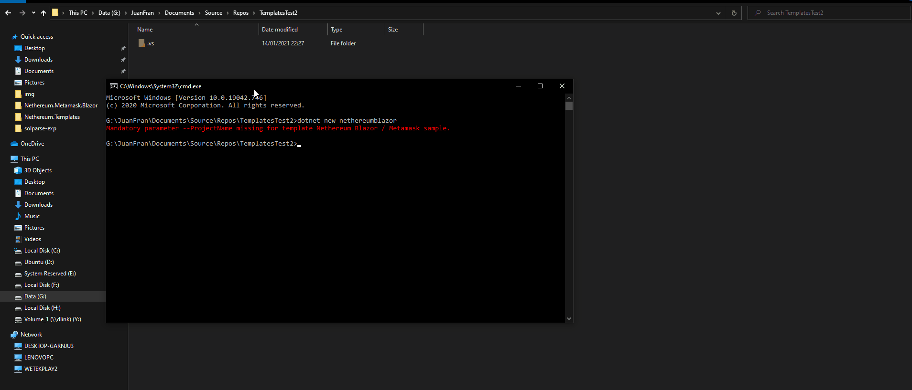

# Nethereum.Metamask.Blazor
This projects provides both the components and and quick start example/template on how to integrate Metamask + Nethereum using Blazor interop. The project allows you to work both in Wasm and Server side, so you can create a fully decentralised application using Wasm or semi-decentralised using server hosted components (Web3+Web2).

Both project types include and exapmle on how to:
+ Configure Metamask as a UI host provider
+ Connect to Metamask
+ Interact with Ethereum using simple Web3 rpc calls (Blockhash and ChainId)
+ Sign messages / authenticate message example using SIWE
+ How to create a generic component for ERC20 token transfer including simple validation using FluentValidation 

### Demo

### Template installation


### Example code
#### Configuration
```csharp
builder.Services.AddScoped(sp => new HttpClient { BaseAddress = new Uri(builder.HostEnvironment.BaseAddress) });
builder.Services.AddSingleton<IMetamaskInterop, MetamaskBlazorInterop>();
builder.Services.AddSingleton<MetamaskInterceptor>();
builder.Services.AddSingleton<MetamaskHostProvider>();
builder.Services.AddSingleton<IEthereumHostProvider>(serviceProvider =>
{
    return serviceProvider.GetService<MetamaskHostProvider>();
});
builder.Services.AddSingleton<NethereumSiweAuthenticatorService>();
builder.Services.AddValidatorsFromAssemblyContaining<Nethereum.Erc20.Blazor.Erc20Transfer>();

```
#### Page
```csharp
@page "/"
@using Nethereum.Erc20.Blazor;
@inject IJSRuntime jsRuntime;
@inject IEthereumHostProvider _ethereumHostProvider;
@inject NethereumSiweAuthenticatorService  _nethereumSiweAuthenticatorService;
@inject NavigationManager _navigationManager
@using Nethereum.Hex.HexTypes;
@using Nethereum.Siwe.Core

@if (EthereumAvailable == true && !string.IsNullOrEmpty(SelectedAccount))
{
<div class="card m-1">
    <div class="card-body">
        <div class="row">
            <label class="col-sm-3 col-form-label-lg">Selected Account:</label>
            <div class="col-sm-6">
                @SelectedAccount
                <small id="selectedAccountHelp" class="form-text text-muted">The selected account is bound to the host (ie Metamask) on change</small>
            </div>
        </div>
    </div>
    <div class="card-body">
        <div class="row">
            <label class="col-sm-3 col-form-label-lg">Selected Network ChainId:</label>
            <div class="col-sm-6">
                @SelectedChainId
                <small id="selectedAccountHelp" class="form-text text-muted">The selected chain Id</small>
            </div>
        </div>
    </div>
</div>

<div class="card m-1">
    <div class="card-body">
        <div class="row">
            <label class="col-sm-3 col-form-label-lg">Block hash of block number 0:</label>
            <div class="col-sm-6">
                <button @onclick="@GetBlockHashAsync">Get BlockHash</button>
                <div>@BlockHash</div>
                <small id="selectedAccountHelp" class="form-text text-muted">With Metamask calls are redirected to its configured node (i.e http://localhost:8545)</small>
            </div>
        </div>
    </div>
</div>

<div class="card m-1">
    <div class="card-body">
        <div class="row">
            <label class="col-sm-3 col-form-label-lg">Authentication by signing:</label>
            <div class="col-sm-6">
                <button @onclick="@AuthenticateAsync">Authenticate</button>
                <div>@AuthenticatedAccount</div>
                <small id="selectedAccountHelp" class="form-text text-muted">Creating an unique challenge per authentication request, allows us to recover and validate what account has signed the message</small>
                @if (ErrorAuthenticateMessage != null)
                {
                    <div class="alert-danger">An error has occurred= @ErrorAuthenticateMessage</div>
                }
            </div>
        </div>
    </div>
</div>


<Erc20Transfer></Erc20Transfer>
} else
{
<div>
    Please connect to Ethereum !
</div>
}

    @code{

        bool EthereumAvailable { get; set; }
        string SelectedAccount { get; set; }
        int SelectedChainId { get; set; }
        string BlockHash { get; set; }
        string TransactionHash { get; set; }
        string ErrorTransferMessage { get; set; }
        string ErrorAuthenticateMessage { get; set; }
        protected string AuthenticatedAccount { get; set; }

        protected override async Task OnInitializedAsync()
        {
            _ethereumHostProvider.SelectedAccountChanged += HostProvider_SelectedAccountChanged;
            _ethereumHostProvider.NetworkChanged += HostProvider_NetworkChanged;
            _ethereumHostProvider.EnabledChanged += HostProviderOnEnabledChanged;
            EthereumAvailable = await _ethereumHostProvider.CheckProviderAvailabilityAsync();
        }


        private async Task HostProviderOnEnabledChanged(bool enabled)
        {
            if (enabled)
            {
                await GetChainId();
                this.StateHasChanged();
            }
        }

        private async Task GetChainId()
        {
            var web3 = await _ethereumHostProvider.GetWeb3Async();
            var chainId = await web3.Eth.ChainId.SendRequestAsync();
            SelectedChainId = (int) chainId.Value;
        }

        private async Task HostProvider_SelectedAccountChanged(string account)
        {
            SelectedAccount = account;
            await GetChainId();
            this.StateHasChanged();
        }

        private async Task HostProvider_NetworkChanged(int chainId)
        {
            SelectedChainId = chainId;
            this.StateHasChanged();
        }


        protected async Task GetBlockHashAsync()
        {
            var web3 = await _ethereumHostProvider.GetWeb3Async();
            var block = await web3.Eth.Blocks.GetBlockWithTransactionsByNumber.SendRequestAsync(new HexBigInteger(1));
            BlockHash = block.BlockHash;
        }

        protected async Task TransferEtherAsync()
        {
            try
            {
                var web3 = await _ethereumHostProvider.GetWeb3Async();

                TransactionHash = await web3.Eth.GetEtherTransferService().TransferEtherAsync("0x13f022d72158410433cbd66f5dd8bf6d2d129924", 0.001m);
            }
            catch (Exception ex)
            {
                ErrorTransferMessage = ex.Message;
            }
        }

        public async Task AuthenticateAsync()
        {

            try
            {
                ErrorAuthenticateMessage = null;
                var siweMessage = await _nethereumSiweAuthenticatorService.RequestUserToSignAuthenticationMessageAsync(new SiweMessage()
                {
                    Address = SelectedAccount,
                    ChainId = SelectedChainId.ToString(),
                    Uri = _navigationManager.ToAbsoluteUri("").ToString(),
                    Domain = _navigationManager.ToAbsoluteUri("").Host,
                    Statement = "Please sign in to authenticate to ExampleProject",

                });

                AuthenticatedAccount = siweMessage.Address;
            }
            catch (Exception ex)
            {
                ErrorAuthenticateMessage = ex.Message;
            }

        }
    }

```
